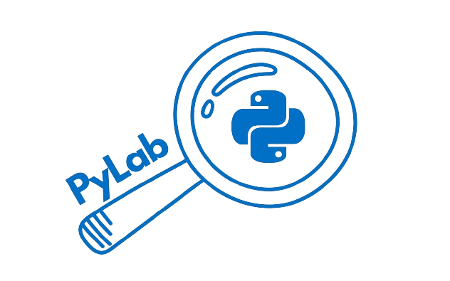

<a href="https://fiuba-pylab.github.io/pylab-deploy/intro">
  
  <h1 align="center">PyLab</h1>
</a>

<p align="center">
    Una aplicación web del lado del cliente desarrollada en Angular para el aprendizaje de algoritmos y automatizaciones para principiantes.  
</p>

<p align="center">
  <a href="#features"><strong>Características</strong></a> ·
  <a href="#colaboradores"><strong>Colaboradores</strong></a> ·
  <a href="#ejecutar-localmente"><strong>Ejecutar Localmente</strong></a>
</p>
<br/>

## Características

- **Angular**: framework para construir una aplicación de página única (SPA) interactiva y fácil de usar.
  - Navegación fluida y optimización de rendimiento para una experiencia de usuario intuitiva.
  - Componentes reutilizables que simplifican el mantenimiento y la extensión del código.
- **Visualización Interactiva**: permite a los estudiantes ejecutar programas paso a paso, observando el cambio de variables y estructuras de control en tiempo real.
- **Soporte Educativo**: incluye comentarios teóricos y explicaciones que guían a los usuarios en la comprensión de los algoritmos y estructuras de control.
- **Flexibilidad de Ejecución**: los usuarios pueden ajustar la velocidad de la ejecución o navegar manualmente entre pasos.
- **Accesibilidad**: aplicación de fácil acceso orientada a estudiantes de programación, especialmente diseñada para el curso de "Pensamiento Computacional" en la Facultad de Ingeniería de la Universidad de Buenos Aires.

## Colaboradores

PyLab fue creado por los estudiantes de Ingeniería en Informática, bajo la supervisión del Profesor Arturo Servetto. El desarrollo se realizó en un entorno colaborativo usando GitHub Projects para la organización de tareas y revisión de código en equipo.

- **[Agustina Schmidt](https://github.com/agusschmidt)** – [LinkedIn](https://www.linkedin.com/in/agustina-schmidt/)
- **[Agustina Fraccaro](https://github.com/agusfraccaro)** – [LinkedIn](https://www.linkedin.com/in/agustina-fraccaro-b306b5213/)
- **[Pedro Flynn](https://github.com/LordOfThePing)** – [LinkedIn](https://www.linkedin.com/in/pedro-flynn/)
- **[Pedro Aguilar](https://github.com/PedroAguilar98)** – [LinkedIn](https://www.linkedin.com/in/pedro-aguilar-527001223/)
- **Supervisor:** Arturo Servetto

## Despliegue

Para desplegar tu propia instancia de PyLab, simplemente clona este repositorio y sigue las instrucciones de instalación en el entorno local. La aplicación está diseñada para correr completamente en el navegador sin necesidad de backend adicional.

## Ejecutar Localmente

Para ejecutar PyLab en tu máquina local, asegúrate de tener configuradas las variables de entorno y sigue estos pasos:

1. Instala Angular CLI (si no lo tienes): `npm install -g @angular/cli`
2. Instala dependencias del proyecto : `npm install --force` 
    (`--force` ya que la dependencia _monacoeditor_ está desactualizada)
3. Clona este repositorio y navega a la carpeta del proyecto.
4. Ejecuta la aplicación con el siguiente comando:

```bash
ng serve --open
```

La aplicación se abrirá en tu navegador predeterminado y estará disponible en [http://localhost:4200](http://localhost:4200).

### Pruebas

Para ejecutar todas las pruebas, usa el siguiente comando:

```bash
npx tests
```

Para ejecutar las pruebas de componentes específicos (dictionary|list|set|tuple), usa el siguiente comando:

```bash
npx tests [nombre-del-componente]
```
